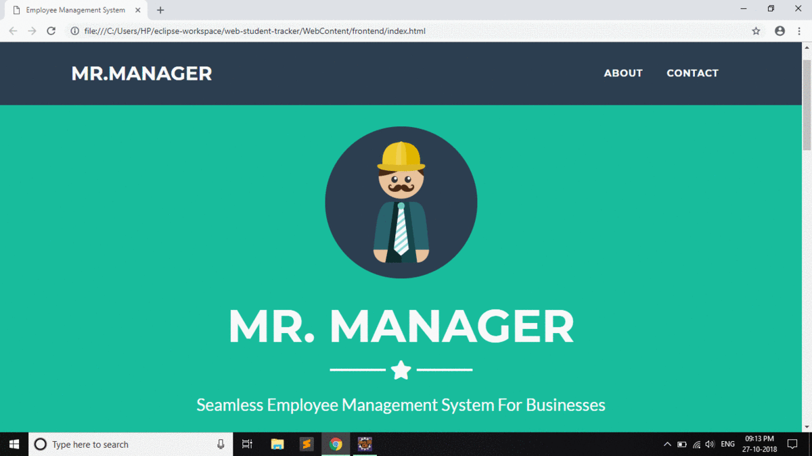

# Employee Management System
### Author: Amitrajit Bose

------------------------------
## Dependencies
```
Apache Tomcat 9.0
MySQL
```

To Run The Project:
- The database structure/schema need to match
- The Apache Tomcat server need to be running (I used Eclipse)
- Create Project named **web-student-tracker** and copy all the files inside it.
- Run the **StudentControllerServlet.java** on Server
- Open from web-student-tracker/WebContent/frontend/index.html

Do not modify the:
- context.xml
- WEB-INF/lib folder

## Technologies Involved
```
Java
JSP
JDBC
Servlets
HTML
CSS
JavaScript
Bootstrap
PHP
MySQL
Apache Tomcat
Eclipse
```

The above README file will be updated soon.
### Demo Walkthrough

*Credits: ezgif.com*

### Contributions
*Closed Project* - Not open to new contributions.
